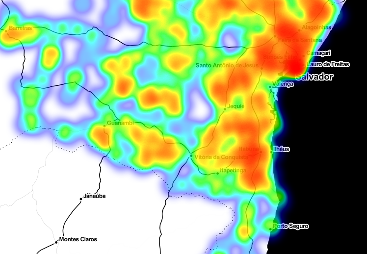

   <h3>✔ Heat map <h3>
 O heatmap feito foi em relação à taxa de casos em relação à população das cidades baiana. Nesse caso foi escolhido um escopo menor (só a Bahia) pois assim teríamos uma granularidade maior nos dados - banco de dados com casos de cada cidade - e assim ficar melhor representado no mapa. Foi utilizada a biblioteca Folium para a renderização e plotagem do mapa e a biblioteca Pandas para o gerenciamento e tratamento dos dados.
 
